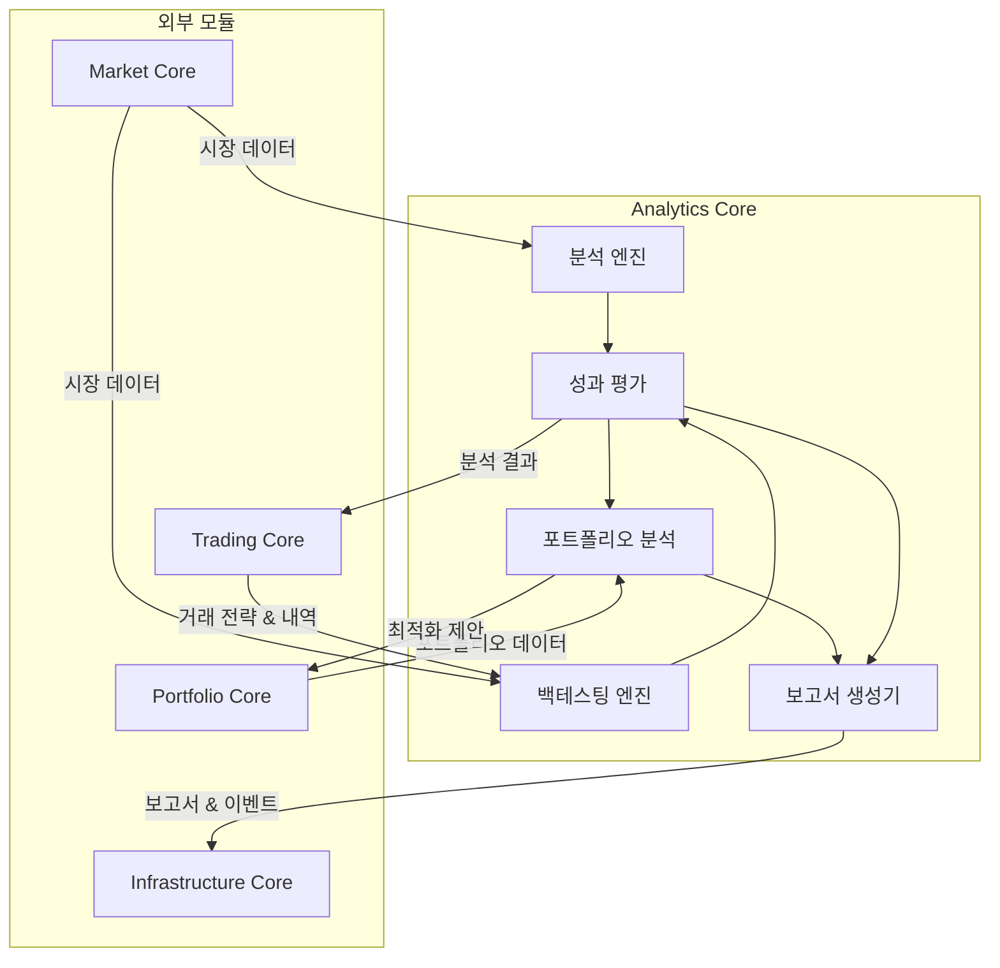
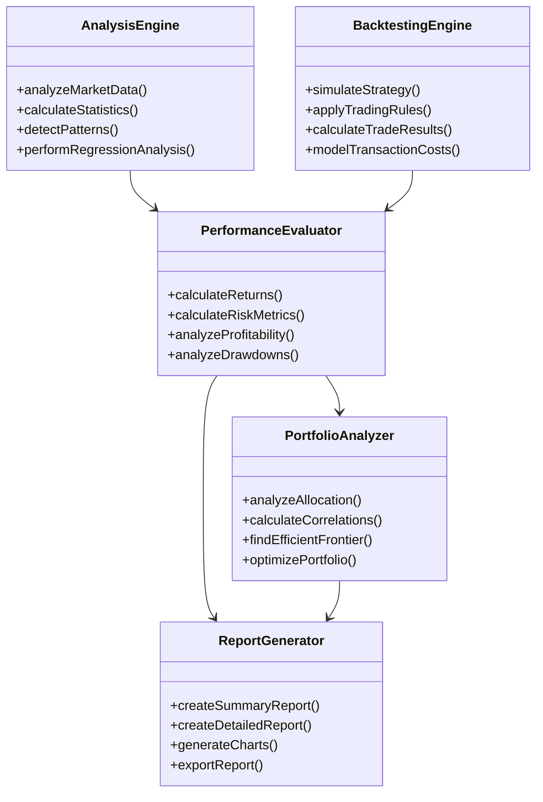
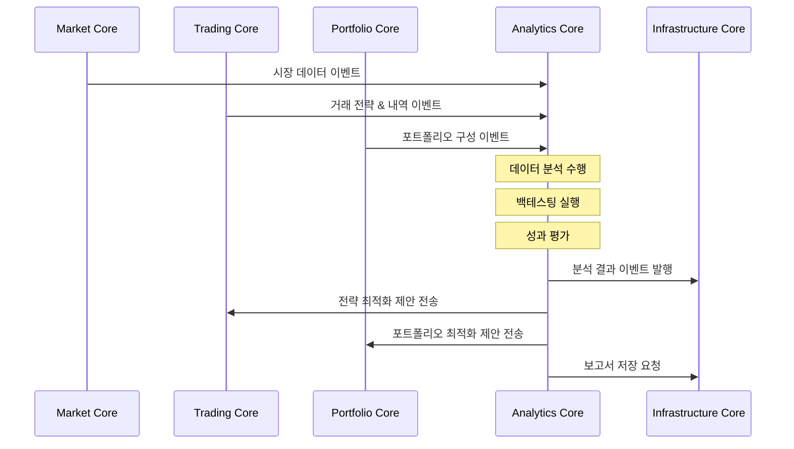

# CryptoLytica Analytics Core

CryptoLytica Analytics Core는 암호화폐 거래 및 투자 전략의 분석, 백테스팅, 성과 평가를 제공하는 핵심 모듈입니다. 이 모듈은 시장 데이터, 거래 데이터, 포트폴리오 데이터를 분석하여 의미 있는 통찰력을 제공합니다.

## 모듈 개요

Analytics Core는 CryptoLytica 플랫폼의 분석 엔진 역할을 담당합니다. 이 모듈은 다음과 같은 기능을 제공합니다:

- **백테스팅**: 거래 전략의 과거 성능 시뮬레이션 및 평가
- **성과 측정**: 샤프 비율, 최대 손실폭, 수익 변동성 등 투자 성과 지표 계산
- **시계열 분석**: 시장 데이터에 대한 통계적 분석 및 패턴 식별
- **포트폴리오 최적화**: 효율적 프런티어 분석 및 자산 배분 최적화
- **리포트 생성**: 분석 결과에 대한 구조화된 보고서 생성
- **시각화**: 분석 결과의 그래프 및 차트 생성

## 주요 구성 요소

Analytics Core는 다음과 같은 주요 구성 요소로 이루어져 있습니다:

### 1. 분석 엔진 (Analysis Engine)

시장 데이터와 트레이딩 데이터에 대한 통계적 분석을 수행하는 컴포넌트입니다.

- 시계열 분석
- 통계적 지표 계산
- 상관관계 및 회귀 분석
- 패턴 인식

### 2. 백테스팅 엔진 (Backtesting Engine)

과거 시장 데이터를 기반으로 트레이딩 전략의 성능을 시뮬레이션하는 컴포넌트입니다.

- 전략 시뮬레이션
- 거래 비용 모델링
- 다양한 시장 조건에서의 전략 테스트
- 성과 측정 및 평가

### 3. 성과 평가 (Performance Evaluation)

트레이딩 전략 및 포트폴리오의 성과를 평가하는 컴포넌트입니다.

- 수익률 계산 (절대/상대)
- 위험 조정 성과 지표 (샤프 비율, 소르티노 비율 등)
- 드로다운 분석
- 변동성 분석

### 4. 포트폴리오 분석 (Portfolio Analysis)

포트폴리오의 구성과 성과를 분석하는 컴포넌트입니다.

- 자산 배분 분석
- 상관관계 매트릭스
- 효율적 프런티어 계산
- 리스크 기여도 분석

### 5. 보고서 생성기 (Report Generator)

분석 결과를 구조화된 보고서로 생성하는 컴포넌트입니다.

- 성과 요약 보고서
- 상세 분석 보고서
- 시각화 및 차트 생성
- 다양한 포맷(HTML, PDF, Markdown) 지원

## Agent 역할과 책임

Analytics Core Agent는 다음과 같은 역할과 책임을 갖습니다:

1. **데이터 수집 및 전처리**
   - 시장 데이터, 거래 내역, 포트폴리오 데이터 수집
   - 결측치 처리, 이상치 탐지, 정규화 등의 데이터 전처리
   - 분석에 적합한 데이터 구조로 변환

2. **분석 작업 수행**
   - 통계적 분석 및 지표 계산
   - 백테스팅 시뮬레이션 실행
   - 포트폴리오 최적화 알고리즘 수행
   - 성과 측정 및 평가

3. **결과 생성 및 배포**
   - 분석 결과 정리 및 구조화
   - 시각화 및 차트 생성
   - 보고서 생성 및 저장
   - 다른 도메인에 분석 결과 이벤트 발행

4. **최적화 및 개선**
   - 트레이딩 전략 매개변수 최적화
   - 포트폴리오 구성 최적화 제안
   - 새로운 분석 모델 및 지표 개발
   - 분석 성능 및 정확도 모니터링

## 다른 모듈과의 관계

Analytics Core는 다음과 같이 다른 모듈과 상호작용합니다:

- **Market Core**: 시장 데이터 수신
- **Trading Core**: 트레이딩 전략 및 거래 내역 정보 수신, 전략 최적화 결과 제공
- **Portfolio Core**: 포트폴리오 구성 및 성과 정보 수신, 포트폴리오 최적화 제안 제공
- **Infrastructure Core**: 데이터 저장 및 이벤트 발행을 위한 인프라 활용

## 아키텍처 다이어그램

## 컴포넌트 다이어그램

## 이벤트 흐름 다이어그램

## 개발 가이드라인

Analytics Core 모듈을 개발할 때 다음 가이드라인을 따라주세요:

1. **확장성 고려**: 새로운 분석 알고리즘, 지표, 보고서 유형을 쉽게 추가할 수 있도록 설계
2. **성능 최적화**: 대량의 시장 데이터 및 트레이딩 내역을 효율적으로 처리할 수 있도록 구현
3. **도메인 경계 존중**: 다른 도메인의 책임 영역을 침범하지 않고 필요한 데이터만 이벤트로 수신
4. **테스트 가능성**: 모든 분석 로직에 대한 단위 테스트 및 통합 테스트 작성
5. **정확성 검증**: 분석 결과와 백테스트 결과의 정확성을 검증할 수 있는 매커니즘 구현 