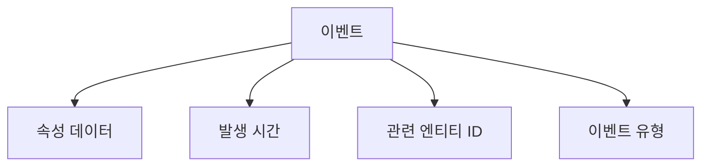

# CryptoLytica 시스템 이벤트 정의

이 문서는 CryptoLytica 시스템에서 발생하는 모든 이벤트를 명제 형태로 정의합니다. DOD(Data-Oriented Design)와 ECS(Entity Component System) 패턴에 따라 이벤트 중심으로 시스템을 구성합니다.

## 이벤트 구성 방식

각 이벤트는 명제 형태로 표현됩니다. 이벤트는 과거 시제를 사용하여 "무엇이 일어났는가"를 명확하게 표현합니다.

## 1. 거래소 컨텍스트 이벤트

### 1.1 거래소 연결 관련 이벤트
- `거래소에_연결되었다` (ExchangeConnected)
- `거래소_연결이_해제되었다` (ExchangeDisconnected)
- `거래소_연결에_실패했다` (ExchangeConnectionFailed)
- `거래소_인증에_성공했다` (ExchangeAuthenticationSucceeded)
- `거래소_인증에_실패했다` (ExchangeAuthenticationFailed)
- `거래소_API_호출_제한에_도달했다` (ExchangeRateLimitReached)

### 1.2 거래소 구성 관련 이벤트
- `거래소가_추가되었다` (ExchangeAdded)
- `거래소_설정이_변경되었다` (ExchangeUpdated)
- `거래소가_제거되었다` (ExchangeRemoved)
- `거래소_기능이_토글되었다` (ExchangeFeatureToggled)

## 2. 시장 데이터 컨텍스트 이벤트

### 2.1 데이터 수집 관련 이벤트
- `시장_데이터가_수신되었다` (MarketDataReceived)
- `OHLCV_데이터가_수신되었다` (OHLCVDataReceived)
- `오더북_데이터가_수신되었다` (OrderBookReceived)
- `거래_데이터가_수신되었다` (TradeDataReceived)
- `데이터_수집이_시작되었다` (DataCollectionStarted)
- `데이터_수집이_중지되었다` (DataCollectionStopped)
- `데이터_수집에_실패했다` (DataCollectionFailed)

### 2.2 데이터 처리 관련 이벤트
- `시장_데이터가_정규화되었다` (MarketDataNormalized)
- `시장_데이터가_집계되었다` (MarketDataAggregated)
- `이상_데이터가_감지되었다` (AnomalyDetected)
- `시장_데이터_유효성이_검증되었다` (MarketDataValidated)

### 2.3 데이터 저장 관련 이벤트
- `시장_데이터가_저장되었다` (MarketDataStored)
- `시장_데이터_조회가_요청되었다` (MarketDataFetchRequested)
- `시장_데이터_조회가_완료되었다` (MarketDataFetched)
- `데이터_보존_정책이_적용되었다` (DataRetentionPolicyApplied)

## 3. 분석 컨텍스트 이벤트

### 3.1 분석 작업 관련 이벤트
- `분석_작업이_생성되었다` (AnalysisJobCreated)
- `분석_작업이_시작되었다` (AnalysisJobStarted)
- `분석_작업이_완료되었다` (AnalysisJobCompleted)
- `분석_작업이_실패했다` (AnalysisJobFailed)
- `분석_결과가_이용_가능해졌다` (AnalysisResultsAvailable)

### 3.2 분석 모델 관련 이벤트
- `모델_학습이_시작되었다` (ModelTrainingStarted)
- `모델_학습이_완료되었다` (ModelTrainingCompleted)
- `모델_학습이_실패했다` (ModelTrainingFailed)
- `모델이_배포되었다` (ModelDeployed)
- `모델_예측이_생성되었다` (ModelPredictionGenerated)

### 3.3 시장 패턴 관련 이벤트
- `패턴이_감지되었다` (PatternDetected)
- `변동성_분석이_완료되었다` (VolatilityAnalysisCompleted)
- `상관관계_분석이_완료되었다` (CorrelationAnalysisCompleted)
- `추세_변화가_감지되었다` (TrendChangeDetected)

## 4. 포트폴리오 컨텍스트 이벤트

### 4.1 포트폴리오 관리 이벤트
- `포트폴리오가_생성되었다` (PortfolioCreated)
- `포트폴리오가_업데이트되었다` (PortfolioUpdated)
- `포트폴리오가_삭제되었다` (PortfolioDeleted)
- `자산이_포트폴리오에_추가되었다` (AssetAddedToPortfolio)
- `자산이_포트폴리오에서_제거되었다` (AssetRemovedFromPortfolio)

### 4.2 포트폴리오 분석 이벤트
- `포트폴리오_성과가_계산되었다` (PortfolioPerformanceCalculated)
- `포트폴리오_리밸런싱이_수행되었다` (PortfolioRebalanced)
- `최적_자산_배분이_계산되었다` (OptimalAllocationCalculated)
- `리스크_분석이_완료되었다` (RiskAnalysisCompleted)

## 5. 알림 컨텍스트 이벤트

### 5.1 알림 관리 이벤트
- `알림이_구성되었다` (AlertConfigured)
- `알림_조건이_충족되었다` (AlertTriggered)
- `알림이_전달되었다` (AlertDelivered)
- `알림_전달에_실패했다` (AlertDeliveryFailed)

## 6. 시스템 트레이딩 컨텍스트 이벤트

### 6.1 전략 관리 이벤트
- `트레이딩_전략이_생성되었다` (TradingStrategyCreated)
- `트레이딩_전략이_활성화되었다` (TradingStrategyActivated)
- `트레이딩_전략이_비활성화되었다` (TradingStrategyDeactivated)
- `트레이딩_전략이_업데이트되었다` (TradingStrategyUpdated)
- `트레이딩_전략이_백테스트되었다` (TradingStrategyBacktested)

### 6.2 신호 및 실행 이벤트
- `매수_신호가_발생했다` (BuySignalGenerated)
- `매도_신호가_발생했다` (SellSignalGenerated)
- `주문이_생성되었다` (OrderCreated)
- `주문이_제출되었다` (OrderSubmitted)
- `주문이_체결되었다` (OrderFilled)
- `주문이_취소되었다` (OrderCancelled)
- `주문이_거부되었다` (OrderRejected)
- `주문이_부분_체결되었다` (OrderPartiallyFilled)

### 6.3 성과 및 모니터링 이벤트
- `전략_성과가_계산되었다` (StrategyPerformanceCalculated)
- `전략_리스크가_평가되었다` (StrategyRiskAssessed)
- `전략_한도에_도달했다` (StrategyLimitReached)
- `비정상_트레이딩_행동이_감지되었다` (AbnormalTradingBehaviorDetected)
- `목표_달성률이_업데이트되었다` (TargetAchievementUpdated)

## 7. 기술 인프라 이벤트

### 7.1 WASM 통합 관련 이벤트
- `WASM_모듈이_컴파일되었다` (WasmModuleCompiled)
- `WASM_모듈이_로드되었다` (WasmModuleLoaded)
- `WASM_함수가_호출되었다` (WasmFunctionCalled)
- `WASM_함수_호출이_완료되었다` (WasmFunctionCallCompleted)
- `WASM_함수_호출에_실패했다` (WasmFunctionCallFailed)
- `WASM_메모리가_할당되었다` (WasmMemoryAllocated)
- `WASM_메모리가_해제되었다` (WasmMemoryDeallocated)

### 7.2 HTTP/3 통신 관련 이벤트
- `HTTP3_연결이_설정되었다` (Http3ConnectionEstablished)
- `HTTP3_연결이_종료되었다` (Http3ConnectionClosed)
- `HTTP3_연결_오류가_발생했다` (Http3ConnectionError)
- `HTTP3_스트림이_생성되었다` (Http3StreamCreated)
- `HTTP3_스트림이_종료되었다` (Http3StreamClosed)
- `HTTP3_요청이_전송되었다` (Http3RequestSent)
- `HTTP3_응답이_수신되었다` (Http3ResponseReceived)
- `HTTP3_데이터_전송_우선순위가_변경되었다` (Http3DataPriorityChanged)

### 7.3 성능 및 모니터링 이벤트
- `시스템_자원_사용량이_임계값을_초과했다` (SystemResourceThresholdExceeded)
- `지연_시간이_임계값을_초과했다` (LatencyThresholdExceeded)
- `메모리_사용량이_임계값을_초과했다` (MemoryUsageThresholdExceeded)
- `디스크_사용량이_임계값을_초과했다` (DiskUsageThresholdExceeded)
- `CPU_사용량이_임계값을_초과했다` (CpuUsageThresholdExceeded)
- `네트워크_대역폭_사용량이_임계값을_초과했다` (NetworkBandwidthThresholdExceeded)
- `서비스_상태가_변경되었다` (ServiceStatusChanged)

## 8. DOD/ECS 관련 구조 이벤트

### 8.1 엔티티 관리 이벤트
- `엔티티가_생성되었다` (EntityCreated)
- `엔티티가_삭제되었다` (EntityDeleted)
- `컴포넌트가_엔티티에_추가되었다` (ComponentAddedToEntity)
- `컴포넌트가_엔티티에서_제거되었다` (ComponentRemovedFromEntity)
- `컴포넌트가_업데이트되었다` (ComponentUpdated)

### 8.2 시스템 관리 이벤트
- `시스템이_초기화되었다` (SystemInitialized)
- `시스템이_활성화되었다` (SystemActivated)
- `시스템이_비활성화되었다` (SystemDeactivated)
- `시스템_처리가_시작되었다` (SystemProcessingStarted)
- `시스템_처리가_완료되었다` (SystemProcessingCompleted)
- `시스템_처리에_실패했다` (SystemProcessingFailed)

### 8.3 데이터 흐름 이벤트
- `데이터_일괄_처리가_시작되었다` (DataBatchProcessingStarted)
- `데이터_일괄_처리가_완료되었다` (DataBatchProcessingCompleted)
- `데이터_스트림_처리가_시작되었다` (DataStreamProcessingStarted)
- `데이터_스트림_처리가_일시_중지되었다` (DataStreamProcessingPaused)
- `데이터_스트림_처리가_재개되었다` (DataStreamProcessingResumed)
- `데이터_스트림_처리가_완료되었다` (DataStreamProcessingCompleted) 